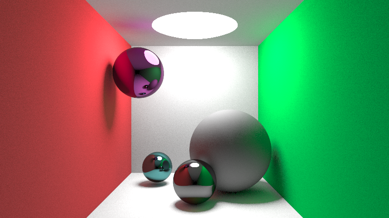

# Global Illuminaton Ray Tracer
In this program a Cornell Box and a collection of spheres are visualized with an advanced ray tracer. This ray tracer includes global illumination, and is built with the Cook-Torrance bidirectional reflectance distribution function (BRDF). All the objects in the scene can be customized with different colors and different levels of emission, roughness, specularity and metalness.

 
### Technical details
This ray tracer uses the rendering equation,

and for the reflective part, we have approximated it with the Cook-Torrance reflectance equation, which consists of the normal distribution function, the geometry function and the Fresnel equation. Those have been approximated with the Trowbridge-Reitz GGX, Schlick-GGX and the Fresnel-Schlick approximation.

You can have a look at our blog to learn more about this project, or just to follow along in how we created it at [visualraytracing.wordpress.com](https://visualraytracing.wordpress.com/).